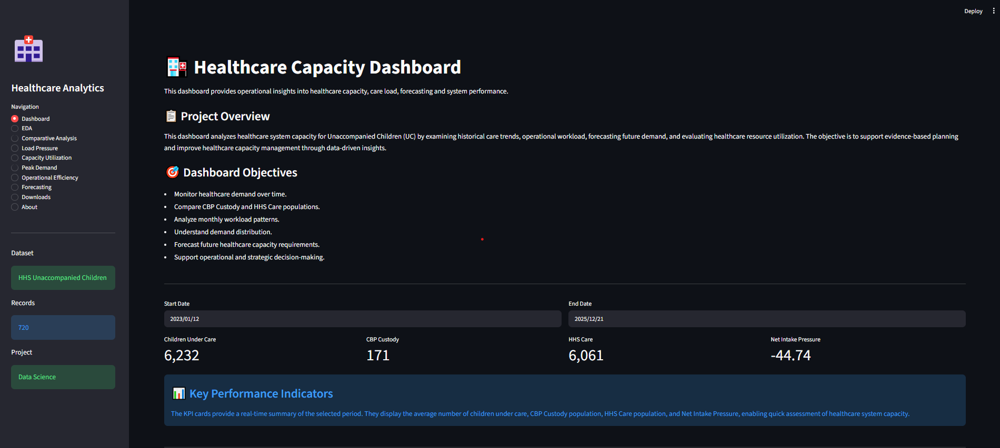
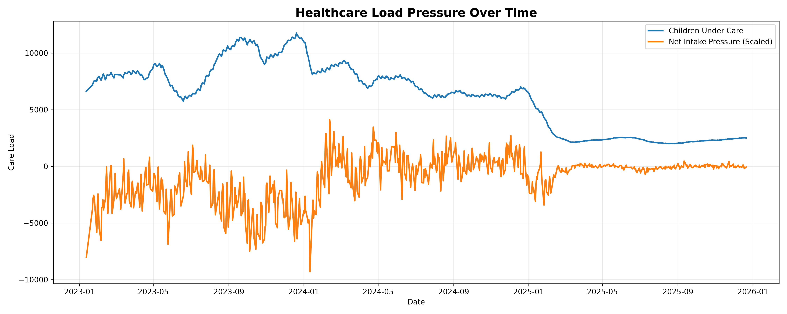
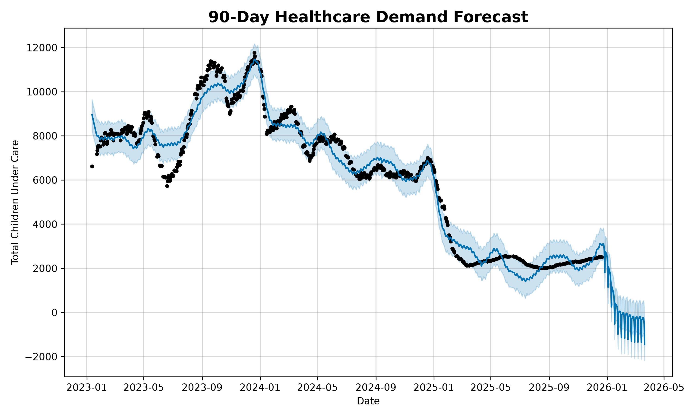

# 🏥 System Capacity & Care Load Analytics for Unaccompanied Children


---

## 📌 Overview

**System Capacity & Care Load Analytics for Unaccompanied Children** is an end-to-end healthcare analytics project developed to analyze historical operational data from the U.S. Department of Health and Human Services (HHS).

The project combines **data analytics, interactive visualization, and machine learning forecasting** to monitor healthcare demand, evaluate operational efficiency, identify capacity trends, and predict future care load.

The final solution is deployed as an interactive **Streamlit Dashboard**, enabling users to explore historical patterns, operational KPIs, and predictive insights through an intuitive interface.

---

## 🎯 Project Objectives

- Analyze historical healthcare capacity trends.
- Monitor operational healthcare workload.
- Evaluate Net Intake Pressure and capacity utilization.
- Discover hidden patterns using Exploratory Data Analysis (EDA).
- Compare healthcare performance across different periods.
- Forecast future healthcare demand using Machine Learning.
- Deliver an interactive decision-support dashboard for operational planning.

---

## ✨ Key Features

- 📊 Interactive Streamlit Dashboard
- 📈 16+ Business & Healthcare Visualizations
- 📉 Comparative Time-Series Analysis
- 🏥 Capacity Utilization Monitoring
- ⚖ Operational Efficiency Analysis
- 🔥 Peak Demand Detection
- 🤖 Linear Regression Forecasting
- 📅 Prophet Time-Series Forecasting
- 📥 Exportable Forecast & Summary Reports
- 🎨 Interactive Plotly Charts

---

# 📷 Dashboard Preview

## Executive Dashboard

> Displays key healthcare KPIs including total children under care, CBP custody, HHS care, Net Intake Pressure, and overall healthcare demand trends.

<p align="center">

</p>

---
## 📊 Exploratory Data Analysis

Exploratory Data Analysis (EDA) was performed to understand healthcare demand patterns, operational performance, and resource utilization. The analysis includes trend analysis, pressure indicators, utilization metrics, and distribution analysis to identify meaningful insights from historical healthcare data.

### 📈 EDA Dashboard

<p align="center">
  
</p>

### Key Insights

- Healthcare demand showed significant fluctuations across the study period.
- Capacity utilization changed considerably following major demand shifts.
- Operational workload reduced substantially during later periods.
- Monthly demand patterns highlighted seasonal variations.
- Distribution analysis revealed periods of both high and low healthcare load.
- Correlation analysis identified relationships between major operational indicators.

### EDA Visualizations Included

- Daily Healthcare Demand Trend
- 7-Day Rolling Average
- Monthly Average Demand
- Net Intake Pressure
- Care Load Volatility
- Monthly Volatility Analysis
- Backlog Accumulation Rate
- Discharge Offset Ratio
- Correlation Heatmap
- CBP vs HHS Care Comparison
- Capacity Utilization Analysis
- Load Pressure Analysis
- Peak Demand Analysis
- Operational Efficiency Analysis

---

## 🤖 Machine Learning Forecasting


To support proactive healthcare planning, predictive models were developed to estimate future healthcare demand. The project combines a baseline Linear Regression model with Facebook Prophet to analyze historical trends and generate future forecasts.

### 📈 Forecast Results

<p align="center">
  
</p>

### Models Used

| Model | Purpose |
|--------|---------|
| Linear Regression | Baseline trend prediction |
| Facebook Prophet | Time-series forecasting with trend and seasonality |

### Forecast Highlights

- Predicted healthcare demand for the next 90 days.
- Captured long-term demand trends using Prophet.
- Identified seasonal healthcare demand patterns.
- Compared actual values with model predictions.
- Generated forecast data for operational planning.
- Exported forecast results for further analysis.

### Generated Outputs

- `forecast_90_days.csv`
- `linear_regression_model.pkl`
- `prophet_forecast_model.pkl`

---

# 🏗 Project Architecture

```
Healthcare Dataset
        │
        ▼
Data Cleaning & Preprocessing
        │
        ▼
Exploratory Data Analysis
        │
        ├───────────────┐
        ▼               ▼
Business Insights   Machine Learning
        │               │
        ▼               ▼
Linear Regression   Prophet Forecast
        │               │
        └───────┬───────┘
                ▼
      Streamlit Dashboard
                │
                ▼
     Executive Reports & Forecasts
```

---

# 📁 Project Structure

```text
System Capacity & Care Load Analytics for Unaccompanied Children
│
├── Data/
│   └── HHS_Unaccompanied_Alien_Children_Program.csv
│
├── Graphs/
│   ├── EDA Visualizations
│   ├── Dashboard Charts
│   ├── Machine Learning Graphs
│   └── Forecast Visualizations
│
├── Models/
│   ├── linear_regression_model.pkl
│   └── prophet_forecast_model.pkl
│
├── Outputs/
│   ├── cleaned_healthcare_data.csv
│   ├── executive_summary.csv
│   └── forecast_90_days.csv
│
├── Reports/
│
├── app.py
├── requirements.txt
├── README.md
├── .gitignore
└── Jupyter Notebook
```
## ⚡ Quick Start

```bash
git clone https://github.com/<your-username>/System-Capacity-Care-Load-Analytics.git

cd System-Capacity-Care-Load-Analytics

python -m venv venv

venv\Scripts\activate

pip install -r requirements.txt

streamlit run app.py
```
---

# 📂 Dataset

**Dataset Name**

HHS Unaccompanied Alien Children Program

**Source**

U.S. Department of Health and Human Services (HHS)

**Records**

- 720 Daily Records

**Time Period**

January 2023 – December 2025

**Primary Variables**

- Children Apprehended
- CBP Custody
- HHS Care
- Children Discharged
- Total Children Under Care

---

# 🤖 Machine Learning Workflow

The project includes two forecasting approaches to estimate future healthcare demand.

## 1️⃣ Linear Regression

A baseline machine learning model used to identify the long-term trend of children under care based on historical observations.

### Purpose

- Learn the overall demand trend
- Compare predicted values with historical observations
- Provide a simple forecasting baseline

### Output

- Actual vs Predicted Comparison
- Regression Trend Line

---

## 2️⃣ Prophet Forecasting

Facebook Prophet is used for advanced time-series forecasting.

Unlike Linear Regression, Prophet models:

- Long-term trends
- Seasonality
- Future demand patterns
- Uncertainty intervals

### Outputs

- Forecast Plot
- Trend Component
- Weekly Seasonality
- Yearly Seasonality
- 90-Day Future Forecast

---

# 📊 Key Insights

Analysis of the healthcare dataset revealed several important operational patterns.

### Healthcare Demand

- Healthcare demand increased significantly during late 2023.
- Peak care load exceeded **11,000 children under care**.
- Demand gradually declined throughout 2024.
- A major reduction in care load occurred during early 2025.

---

### Capacity Utilization

- Healthcare facilities experienced periods of high utilization during demand peaks.
- Capacity requirements stabilized following the decline in total care load.

---

### Operational Efficiency

- Net Intake Pressure improved during later periods.
- Backlog accumulation reduced considerably over time.
- Discharge efficiency increased after healthcare demand declined.

---

### Machine Learning

- Linear Regression successfully captured the long-term downward trend.
- Prophet identified seasonal patterns and generated future demand forecasts with confidence intervals.

---

## 📂 Project Outputs

The project generates cleaned datasets, trained machine learning models, visualizations, and forecast reports for further analysis.

| Output | Description |
|---------|-------------|
| `cleaned_healthcare_data.csv` | Cleaned and preprocessed healthcare dataset |
| `forecast_90_days.csv` | 90-day healthcare demand forecast |
| `executive_summary.csv` | Summary of key healthcare KPIs |
| `linear_regression_model.pkl` | Trained Linear Regression model |
| `prophet_forecast_model.pkl` | Trained Prophet forecasting model |
| `Graphs/` | All generated visualizations |

---

## 💻 Installation

### Clone the Repository

```bash
git clone https://github.com/<your-username>/System-Capacity-Care-Load-Analytics.git
```

### Navigate to the Project

```bash
cd System-Capacity-Care-Load-Analytics
```

### Create a Virtual Environment

```bash
python -m venv venv
```

### Activate the Environment

**Windows**

```bash
venv\Scripts\activate
```

**Linux / macOS**

```bash
source venv/bin/activate
```

### Install Dependencies

```bash
pip install -r requirements.txt
```

---

## ▶️ Running the Application

Launch the Streamlit dashboard using:

```bash
streamlit run app.py
```

The dashboard will open automatically in your default web browser.

---

## 📈 Project Results

The project successfully transformed raw healthcare operational data into an interactive decision-support system.

### Key Outcomes

- Developed a complete healthcare analytics pipeline.
- Generated 16+ business-oriented visualizations.
- Built interactive dashboards using Streamlit and Plotly.
- Trained predictive models using Linear Regression and Prophet.
- Produced future healthcare demand forecasts.
- Exported cleaned datasets and analytical reports.
- Delivered actionable operational insights for healthcare planning.

---

## 🔮 Future Enhancements

Potential improvements include:

- Real-time healthcare data integration
- Automated dashboard refresh
- Advanced forecasting models (LSTM, XGBoost)
- Anomaly detection for operational monitoring
- Cloud deployment using AWS or Azure
- REST API integration
- Role-based authentication
- Interactive drill-down analytics

---

## 🛠 Technologies Used

| Category | Technologies |
|----------|--------------|
| Programming | Python |
| Data Analysis | Pandas, NumPy |
| Visualization | Plotly, Matplotlib |
| Machine Learning | Scikit-learn |
| Forecasting | Prophet |
| Dashboard | Streamlit |
| Model Storage | Joblib |
| Development | Jupyter Notebook, VS Code |
| Version Control | Git & GitHub |

---
# 👨‍💻 Author

**Bandham Raju**

Aspiring Data Scientist | Data Analyst

- LinkedIn: [*(www.linkedin.com/in/raju-bandham)*](https://www.linkedin.com/in/raju-bandham)
- GitHub: [*(github.com/BandhamRaju)*](https://github.com/BandhamRaju)
- Email: [*(Bandhamraju2@gmail.com)*](Bandhamraju2@gmail.com)

---

## 📜 License

This project is licensed under the **MIT License**.

See the `LICENSE` file for more information.

---

<div align="center">

### ⭐ Thank you for visiting this repository!

**Built with Python, Streamlit, Plotly, Scikit-learn, and Prophet**

</div>
